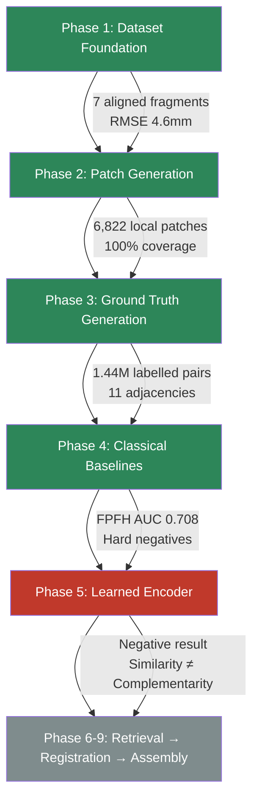
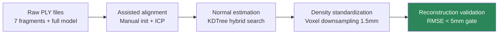
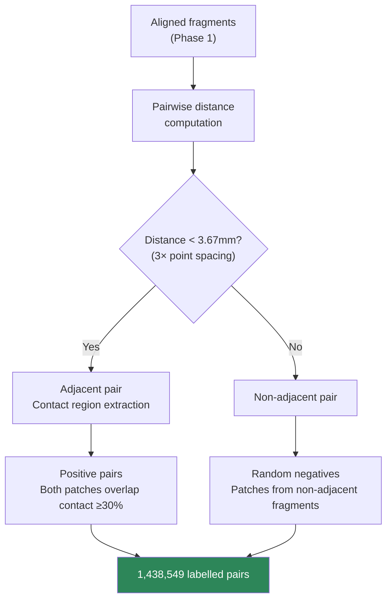
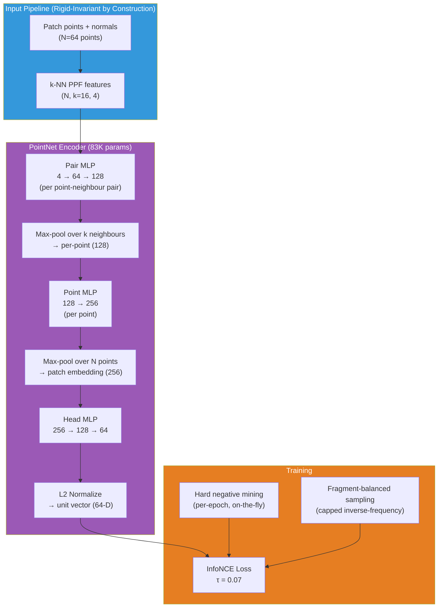
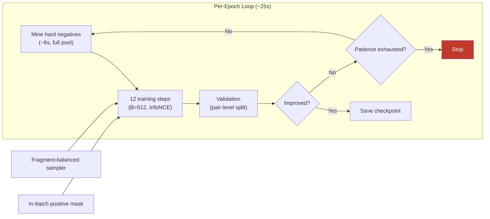
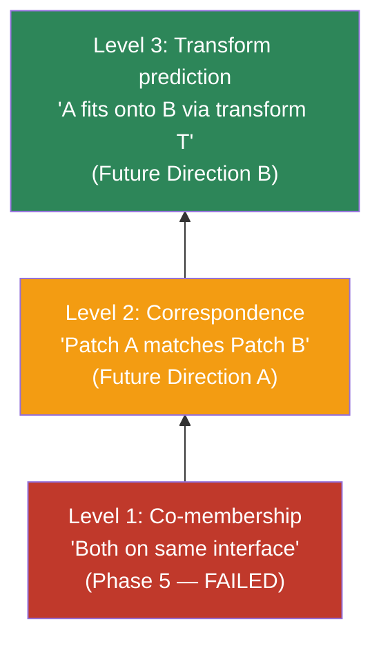
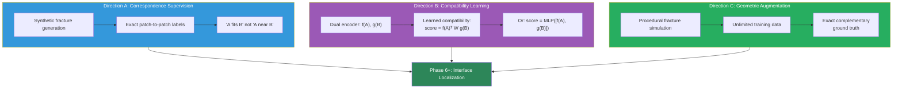
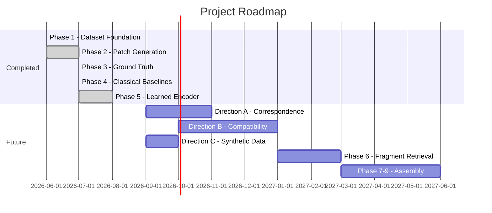

# From Similarity to Complementarity: What a Broken Caesar Taught Us About Learning to Reassemble History

**Title Options:**
1. *From Similarity to Complementarity: What a Broken Caesar Taught Us About Learning to Reassemble History*
2. *Teaching Machines to Reassemble Broken History — And Why They Learn the Wrong Thing*
3. *The Similarity Trap: Lessons from Training a Neural Network to Reconstruct a Fractured Roman Statue*
4. *When Looking Alike Isn't Enough: A Deep Learning Pipeline for Cultural Heritage Reconstruction*
5. *Co-Membership ≠ Correspondence: A GSoC Journey Through 3D Fragment Assembly*

---

## 1. Introduction

Every year, archaeological excavations recover thousands of fragmented artifacts — pottery sherds, broken statues, shattered reliefs. Reassembling them by hand requires extraordinary expertise, patience, and time. A single object might take months of trial-and-error fitting by conservators. Worse, many fragments are separated across museums, making physical reassembly impossible.

The computational version of this problem — automatic 3D fragment assembly — asks: given point cloud scans of individual fragments, can a machine determine which pieces are neighbours, where they touch, and how to place them to reconstruct the original?

This is harder than it appears. Unlike jigsaw puzzles with clear visual cues, real fracture surfaces are often smooth, weathered, or geometrically ambiguous. A fragment's break surface may be indistinguishable from its original sculpted surface. Standard computer vision approaches that rely on detecting "the fracture" and then matching it often fail precisely when they're needed most.

This blog documents an 11-week GSoC project that built a complete pipeline for this problem — from raw scans through ground truth generation, classical baselines, and learned representations — culminating in a scientific discovery about why standard contrastive learning fails for assembly tasks, and what that failure reveals about the fundamental distinction between *geometric similarity* and *geometric complementarity*.

[FIGURE 1 HERE]

**Figure 1.** *Seven fragments of a fractured Caesar statue reassembled into the original form. The reconstruction achieves 4.6mm RMSE with 100% coverage — the complete object serves only as ground-truth reference, never as input.*

> **Repository path:** `assets/phase1_assembly.png`
> **Reason:** This is the project's hero image — it immediately communicates the problem (fragmented statue) and the goal (reconstruction) in one visual.

---

## 2. Project Goals

**Input:** 7 fragmented 3D point cloud scans of a broken Caesar statue (~837K vertices total).

**Output:** Recovered fragment relationships and reconstructed original object.

**Key constraint:** The complete model is available *only* for generating training data and ground truth — never at inference time. This mirrors real-world conditions where the original is unknown.

The project decomposes into a phased pipeline, each phase producing validated outputs that feed the next:



**Design philosophy:** baselines before deep learning. Every method is evaluated for *what it learns, why it helps assembly, and how it fails* before proceeding. A neural model must earn its complexity against interpretable references.

---

## 3. Building the Dataset (Phase 1)

The source data is a 3D scan of a fractured Caesar statue: one complete model (837,781 vertices) and seven individual fragment scans. The fragments were physically broken from the original — not synthetically generated — making this a realistic testbed for archaeological assembly.

### Preprocessing Pipeline



**Why not automatic alignment?** The Caesar statue is approximately symmetric — automatic FPFH+RANSAC alignment achieves high fitness scores while snapping fragments to the *wrong* symmetric region. This was the project's first lesson: **metrics are not correctness**. We used assisted manual alignment (rough placement + ICP refinement) with visual verification as the real validation gate.

**Results:**

| Metric | Value |
|--------|-------|
| Fragments aligned | 7/7 (visually confirmed) |
| Reconstruction RMSE | 4.60 mm |
| Coverage | 100% |
| Mean point spacing | 1.22 mm |

[FIGURE 2 HERE]

**Figure 2.** *Phase 2 patch generation: overlapping local geometric patches extracted from fragment surfaces using Farthest-Point-Sampling centers with 8mm radius ball queries. Each patch captures ~100 points of local surface geometry.*

> **Repository path:** `assets/phase2_patches.png`
> **Reason:** Visualizes the fundamental unit of the pipeline — local geometric patches — and demonstrates complete surface coverage.

---

## 4. Generating Ground Truth (Phase 3)

The critical question: how do we know which patches are true assembly partners?

Since all fragments are aligned to the complete model (Phase 1), we can measure inter-fragment distances directly and identify which fragments are actually adjacent — then determine which specific patches participate in the contact interface.



### Key Design Decisions

- **Data-driven adjacency threshold:** 3.67mm = 3× measured point spacing (not hand-tuned)
- **Contact-region extraction:** cKDTree distance queries identify which points on each fragment are close to a neighbour
- **Positive pair criteria:** both patches must overlap the contact region by ≥30% (strict)
- **Balanced dataset:** 719K positive + 719K random negative pairs (50/50)

### Results

| Metric | Value |
|--------|-------|
| Adjacent fragment pairs | 11 of 21 possible |
| Positive pairs | 719,279 |
| Random negatives | 719,270 |
| Total labelled pairs | 1,438,549 |
| Compact storage | 7.6 MB (NPZ) |

**Known limitation:** Phase 3 generates zero *hard* negatives. Patches that look similar but belong to non-adjacent fragments cannot be identified purely by spatial distance. This became Phase 4's contribution.

[FIGURE 3 HERE]

**Figure 3.** *Contact regions between adjacent fragment pairs. Each colour marks where one fragment touches a specific neighbour — all contacts sit on fracture surfaces, not sculpted exterior surfaces.*

> **Repository path:** `assets/phase3_contacts.png`
> **Reason:** Directly visualizes the ground truth supervision signal — where fragments actually touch — which is the foundation for all downstream learning.

---

## 5. Classical Geometry Baselines (Phase 4)

Before any learning, we established what handcrafted descriptors can achieve. Phase 4 computed two classical 3D descriptors for all 6,822 patches and evaluated them on retrieval and registration tasks.

### Descriptors

| Descriptor | Dimensions | Method |
|-----------|:----------:|--------|
| **FPFH** | 33 | Darboux-angle histograms in multi-scale neighbourhoods (Rusu 2009) |
| **SHOT** | 352 | Local Reference Frame + angular histograms in spherical volumes (Tombari 2010) |

### Retrieval Results

For each query patch, rank all cross-fragment patches by descriptor distance. A hit is a true assembly partner from the ground-truth pairs.

| Descriptor | Pair ROC-AUC | Ranking mAP | Precision@1 |
|-----------|:------------:|:-----------:|:-----------:|
| FPFH (33-D) | **0.708** | 0.109 | 0.13 |
| SHOT (352-D) | 0.536 | 0.086 | 0.11 |

FPFH beats chance substantially at pair-level classification (AUC 0.708) but has **low absolute ranking power** (mAP 0.109). The failure mode is instructive: flat patches match other flat patches, linear ridges match other ridges, and the true assembly partner is rarely the nearest descriptor neighbour. This is *similarity*, not *compatibility*.

[FIGURE 4 HERE]

**Figure 4.** *FPFH retrieval results. Each row: a black query patch followed by its 8 nearest cross-fragment neighbours (green = true assembly partner, red = false positive). The dominance of red illustrates that geometric similarity ≠ assembly compatibility — look-alike patches from unrelated regions rank higher than true matching partners.*

> **Repository path:** `assets/viz1_retrieval_fpfh.png`
> **Reason:** This is the single most important empirical image — it makes the similarity-vs-complementarity gap viscerally visible.

---

## 6. The Surprising Discovery: Registration Is Not the Bottleneck

Phase 4's registration experiment revealed something unexpected. We perturbed each fragment by a known rigid transform, then attempted recovery using two approaches:

| Mode | Success Rate | Median Rotation Error | Median Translation Error |
|------|:------------:|:---------------------:|:------------------------:|
| **Global** (FPFH+RANSAC+ICP) | **0/11** (0%) | 118.5° | 35.1 mm |
| **Contact-seeded** (GT interface + interface-only ICP) | **10/11** (91%) | 1.5° | 1.6 mm |

**Global registration fails catastrophically** — not because ICP is broken, but because fragments *abut* at a thin interface rather than *overlapping* like two scans of the same scene. RANSAC maximises body overlap and locks onto incorrect high-fitness poses.

**Contact-seeded registration works almost perfectly** — when you know *where* the interface is and refine ICP *only on the contact surface*, 10 of 11 pairs recover to sub-degree, sub-millimetre accuracy. The single failure (F5↔F7) has only 7 contact points — a genuine data limitation.

**Implication:** The rigid alignment backend is solved. The hard problem is **interface localisation** — determining *where* two fragments touch. This is exactly what the learned phase targets.

[FIGURE 5 HERE]

**Figure 5.** *Registration comparison: (left) ground truth pose, (centre) global FPFH+RANSAC+ICP locks onto wrong symmetric position, (right) contact-seeded ICP recovers correct alignment. The registration solver works — the problem is finding the interface to seed it with.*

> **Repository path:** `assets/viz5_registration.png`
> **Reason:** Visually demonstrates the pivotal Phase 4 finding — registration succeeds when the interface is known, establishing the exact problem learned representations must solve.

### Phase 4's Gift to Phase 5: Hard Negatives

FPFH also provided what Phase 3 could not: *hard negative pairs*. By finding patches from non-adjacent fragments with near-identical FPFH descriptors (distance ≈ 0.04), we obtain "look-alike but definitely-not-assembly-partners" — gold for contrastive training.

[FIGURE 6 HERE]

**Figure 6.** *Hard negative candidates: blue patches on one fragment paired with their most similar patches (orange) on a non-adjacent fragment. These look-alike pairs can never assemble — they are the critical training signal for learning to distinguish similarity from compatibility.*

> **Repository path:** `assets/viz6_hard_negatives_fpfh.png`
> **Reason:** Directly visualizes the hard negatives that Phase 5 training uses — establishing the experimental setup for the learning experiments.

---

## 7. Phase 5: Learning the Interface

With the baseline established (FPFH mAP 0.109, AUC 0.708), Phase 5 asked: **can a learned encoder beat handcrafted descriptors at interface-association retrieval?**

### Architecture



### Key Design Choices

| Decision | Choice | Rationale |
|----------|--------|-----------|
| Input features | k-NN PPF (Drost 2010) | Exactly rigid-invariant; comparable to FPFH's Darboux angles without histogram binning |
| Normalization | LayerNorm (not BatchNorm) | BatchNorm running stats trained on 6 fragments create LOFO distribution-shift confound |
| Spatial transformer | **None** (no T-Net) | Would break by-construction pose invariance |
| Hard negatives | On-the-fly encoder-mined | Current model's own look-alikes, re-mined every epoch |
| Evaluation | Leave-One-Fragment-Out (LOFO) | 4 well-supported folds (F1-F4); 7 shortcut probes per fold |
| Positive masking | In-batch positive exclusion | Median 347 positives per patch → without masking, positives contaminate InfoNCE denominator |

### Pre-Registered Success Criteria

Before training, 6 conditions were defined for "genuine Level-3 success" — all must hold:

1. Beat FPFH on macro mAP (contact-only gallery)
2. Win majority of well-supported LOFO folds {F1, F2, F3, F4}
3. Shrink easy-vs-hard AUC gap vs FPFH
4. Positive contact-vs-noncontact gap
5. Pass pose-invariance gate
6. No dominant shortcut (fragment-ID, boundary openness) explaining the gain

### Training Infrastructure



Training ran for 50 epochs per fold on an RTX 4050 (~25s/epoch, ~1GB peak VRAM). Loss decreased from 6.49 to 4.64 (InfoNCE, batch size 512), with validation loss best at epoch 19.

[FIGURE 11 HERE]

**Figure 11.** *Training and validation loss over 50 epochs (Fold 1). Training loss decreases steadily, but the growing train-val gap indicates the model is overfitting to a similarity objective that does not transfer to the held-out fragment's assembly task.*

> **Repository path:** `assets/blog_training_curve.png`
> **Reason:** Shows that the model is learning *something* (loss decreases) but that something does not generalise — establishing that the failure is conceptual, not convergence.

[FIGURE 12 HERE]

**Figure 12.** *Hard-negative mining dynamics: (top) mean distance to the nearest non-adjacent look-alike increases as embeddings spread apart; (bottom) the number of unique hard negatives per batch decreases as the encoder pushes all patches apart. The encoder learns to separate everything — not to match assembly partners.*

> **Repository path:** `assets/blog_mining_dynamics.png`
> **Reason:** Reveals the internal training dynamics that produce the negative result — the encoder is spreading embeddings uniformly rather than clustering assembly partners.

---

## 8. The Negative Result

### Headline Numbers

| Fold (Held-out) | Encoder mAP | FPFH mAP | Difference | CI₉₅ excludes 0? | Verdict |
|:---------------:|:-----------:|:---------:|:----------:|:-----------------:|:-------:|
| F1 | 0.099 | 0.105 | -0.006 | Marginal | — |
| **F2** | **0.107** | **0.139** | **-0.032** | **Yes** | **FPFH wins** |
| **F3** | **0.088** | **0.110** | **-0.022** | **Yes** | **FPFH wins** |
| **F4** | **0.112** | **0.128** | **-0.017** | **Yes** | **FPFH wins** |

The learned encoder is **statistically significantly worse** than FPFH on every well-supported fold. Conditions 1 and 2 both FAILED (0/4 folds won).

[FIGURE 13 HERE]

**Figure 13.** *Per-fold encoder vs FPFH mAP comparison with bootstrap 95% confidence intervals. Left: grouped bars show FPFH (blue) consistently above encoder (red) on every fold. Right: all difference CIs exclude zero on the negative side — the deficit is statistically significant, not noise.*

> **Repository path:** `assets/blog_fold_comparison.png`
> **Reason:** Provides the visual proof that the negative result is not marginal — the encoder consistently and significantly underperforms the handcrafted baseline across all evaluation folds.

### The Smoking Gun: Hard-Negative AUC

The most diagnostic metric is not the headline mAP but the **encoder-mined hard-negative AUC** — can the encoder resist its own look-alikes?

| Fold | Encoder Hard-Neg AUC | Interpretation |
|:----:|:--------------------:|:--------------:|
| F2 | **0.022** | Below chance |
| F3 | **0.045** | Below chance |
| F4 | **0.039** | Below chance |

The encoder *actively prefers* non-adjacent look-alike patches over true assembly partners. It doesn't merely fail to learn complementarity — it learns *anti-complementarity*. The model clusters geometrically similar patches regardless of assembly relevance, which is precisely what FPFH already does, but with 83K learnable parameters achieving a worse version of the same thing.

[FIGURE 14 HERE]

**Figure 14.** *The smoking gun: encoder-mined hard-negative AUC across folds. Green bars (easy negatives) show the encoder can separate positives from random patches. Red bars show it completely fails against its own look-alikes — all below the 0.5 chance line. The encoder learned similarity, not complementarity.*

> **Repository path:** `assets/blog_hard_negative_auc.png`
> **Reason:** This is the single most diagnostic figure in the entire project — it proves the encoder optimises the wrong objective (similarity) rather than merely underperforming on the right one.

### What the Encoder *Did* Learn

Not everything failed. The encoder achieved:
- **Reduced fragment-identity leakage:** Self-retrieval ratio 3.2-3.5× (vs FPFH's 5.8-6.4×)
- **Better easy-vs-hard separation on FPFH-mined pairs:** AUC 0.86 vs FPFH's 0.68

But these are *similarity improvements* — the encoder learns a slightly better general-purpose shape signature. It does not learn what assembly actually needs.

### Six-Condition Verdict

| Condition | Result |
|-----------|--------|
| 1. Beat FPFH on mAP | ❌ FAILED (0/4 folds) |
| 2. Win majority of LOFO folds | ❌ FAILED (0/4) |
| 3. Shrink hard-neg gap | ❌ NOT MET (hard-AUC below chance) |
| 4. Contact-vs-noncontact gap | Partial |
| 5. Pose-invariance gate | ✅ PASSED (by construction) |
| 6. No dominant shortcut | ✅ Improved over FPFH |

**Verdict: Pre-registered NEGATIVE Level-3 result.** The encoder does not learn interface association.

---

## 9. Similarity vs Complementarity: The Central Insight

This is the scientific core of the project. The negative result is not a failure of implementation — it's a **theoretical limitation of the supervision formulation**.

### The Problem

Our positive label says: *"Patch A and Patch B both belong to the same contact interface."*

InfoNCE contrastive loss optimizes: *pull A and B closer in embedding space.*

This means the loss **maximises similarity** between co-members.

But what does assembly actually require?

At a fracture, one side is **convex** and the other is **concave**. The true matching partner doesn't *look like* the query — it looks like its geometric **inverse**. Assembly requires **complementarity**, not similarity.

[FIGURE 15 HERE]

**Figure 15.** *The core insight visualised: (left) similarity — InfoNCE pulls two convex patches together because they look alike, but convex cannot assemble with convex; (right) complementarity — assembly needs convex to match concave, which are geometrically opposite. The loss optimises the left; the task needs the right.*

> **Repository path:** `assets/blog_similarity_vs_complementarity.png`
> **Reason:** This is the centrepiece conceptual figure of the entire blog — it makes the abstract theoretical insight (similarity ≠ complementarity) concrete and immediately understandable.

### The Conceptual Framework

| Concept | Definition | Relevance to Assembly |
|---------|-----------|----------------------|
| **Similarity** | Two regions look alike | Necessary but NOT sufficient — many unrelated regions look alike |
| **Complementarity** | Two regions fit into each other (convex ↔ concave) | What assembly actually needs at a fracture |
| **Distinctiveness** | A region carries unique identifying geometry | Reduces false matches; flat regions are ambiguous |
| **Assembly usefulness** | A region contributes real evidence toward reconstruction | The quantity we ultimately want to learn |

### Why Co-Membership Labels Have a Theoretical Ceiling

```mermaid
graph TD
    subgraph Current ["Current Approach (Failed)"]
        A1["Label: A and B are<br/>on the same interface"] --> B1["Loss: InfoNCE<br/>pull A toward B"]
        B1 --> C1["Optimizes: sim(A,B) ↑"]
        C1 --> D1["Learns: SIMILARITY"]
        D1 --> E1["Result: clusters look-alikes<br/>regardless of assembly"]
    end
    
    subgraph Needed ["What Assembly Needs"]
        A2["Label: A specifically<br/>fits onto B"] --> B2["Loss: compatibility<br/>score(A,B)"]
        B2 --> C2["Optimizes: fit(A,B) ↑"]
        C2 --> D2["Learns: COMPLEMENTARITY"]
        D2 --> E2["Result: convex matches concave<br/>key matches lock"]
    end
    
    style Current fill:#c0392b,color:#fff
    style Needed fill:#2d8659,color:#fff
```



The analogy: imagine trying to learn a key-lock matching function by labelling pairs as "both belong to the same door." Contrastive learning on this label would cluster all keys together and all locks together — because co-membership encourages within-class similarity. But what you need is a function that says "this specific key fits this specific lock" — which requires learning the complementary relationship *between* the two.

### Three Levels of Supervision Strength



Co-membership is the weakest form of assembly supervision. It tells the model *who is near the interface* but not *who specifically fits whom* — and contrastive learning cannot bridge that gap because it optimises the wrong mathematical objective.

---

## 10. Lessons Learned

### Technical Lessons

**1. Pre-registration catches confounds.**
Condition 3 was initially assessed using FPFH-mined hard negatives scored under the encoder — which turned out to be tautologically easy for any non-FPFH embedding (even random embeddings beat it by 0.006). Only the *encoder-mined* hard negatives scored under the encoder itself are a valid test. The pre-registration document's specificity prevented false-positive claims.

**2. LOFO is non-negotiable for small datasets.**
With 7 fragments, any standard train/test split leaks fragment identity into test metrics. Leave-One-Fragment-Out removes any possibility of memorising specific fragment geometry. The fragment-ID probe confirmed this: FPFH has 89% identity leakage (vs 14.3% chance); the encoder reduced this to ~40-50%, but it's still the dominant signal.

**3. LayerNorm over BatchNorm for LOFO evaluation.**
BatchNorm's running statistics are fitted on training fragments only. When the held-out fragment has a different surface distribution (it always does — fragments are physically different), BatchNorm's normalisation becomes a confound indistinguishable from genuine encoding failure.

**4. Hard negatives are diagnostic, not just training data.**
The hard-negative AUC below chance is a *stronger* signal than the headline mAP deficit. It proves the model is optimising the wrong objective (similarity), not merely underperforming on the right one.

**5. Metrics can mislead at every level.**
- Phase 1: FPFH+RANSAC alignment scored high fitness while placed on wrong symmetric region
- Phase 4: Global registration achieves high fitness (0.56) while being 118° wrong
- Phase 5: Training loss decreases steadily while the model learns something useless

### Process Lessons

**6. Baselines before learning — always.**
If we had jumped to deep learning at Phase 2, we would never have understood *why* it fails. FPFH's clear, interpretable failure mode (similarity without complementarity) gave us the precise diagnostic to apply to the learned encoder.

**7. Negative results are publishable results.**
The hard-negative AUC below chance is a clean empirical refutation of the hypothesis "co-membership contrastive learning can learn complementarity." This eliminates a hypothesis and narrows the research search space — more valuable than a marginal positive result.

**8. Document failures as they happen.**
The project logged 8 named recurring failure classes (unit/scope mismatches, epoch-unit confusion, inert jitter fix, confounded metrics). Each was annotated in-place, never silently corrected. This creates an honest record of the research process.

---

## 11. Future Directions

The negative result doesn't end the project — it *focuses* it. The diagnosis is precise: the supervision signal and loss function cannot express complementarity. Three directions address this directly:



### Direction A: Correspondence-Level Supervision

Replace "same interface" labels with specific patch-to-patch correspondence labels.

**Current:** "A and B are co-members of interface I₃₄"
**Proposed:** "A on fragment 3 corresponds to B on fragment 4 (they physically interlock)"

This requires either:
- Synthetic fracture generation with known correspondences
- Dense registration of ground-truth contact surfaces to establish per-point matches
- Learning to predict the local rigid transform that aligns A to B

### Direction B: Compatibility Learning (Dual Encoder)

Replace the symmetric similarity function with a learned asymmetric compatibility scorer.

**Current:** `score = cos(f(A), f(B))` — same encoder, similarity in shared space

**Proposed:** `score = f(A)ᵀ W g(B)` or `score = MLP([f(A), g(B)])`

Key insight: the two sides of a fracture are *not the same distribution*. One side is convex, the other concave. They shouldn't share an encoder. A bilinear form or cross-attention mechanism can learn "convex matches concave" without requiring the two representations to be similar.

### Direction C: Synthetic Fracture Generation

The current dataset has 7 fragments — tiny by deep learning standards. Procedural fracture simulation (Voronoi fracture, physics-based brittle fracture) on diverse 3D models would provide:
- Unlimited training pairs
- Exact complementary ground truth (since the fracture process is known)
- Diverse fracture morphologies

### Full Roadmap



---

## 12. Conclusion: From Similarity to Complementarity

At the start of this GSoC project, the research question was straightforward: "Can a learned representation beat handcrafted features for fragment retrieval?" The implicit assumption was that a neural network, given enough contrastive training signal, would naturally learn to identify assembly partners.

That assumption was wrong — and proving it wrong is the project's main scientific contribution.

The journey taught us:

1. **Registration is solved** (Phase 4) — the hard problem is interface localisation.
2. **FPFH is a strong baseline** — it encodes geometric complexity effectively, but encodes similarity, not compatibility.
3. **Co-membership + contrastive loss has a theoretical ceiling** (Phase 5) — it cannot express complementarity because it optimises the wrong mathematical objective.
4. **Hard negatives are diagnostic** — the below-chance AUC is a cleaner signal than any positive result.
5. **The real research direction is complementarity learning** — dual encoders, correspondence supervision, and compatibility functions.

The project that began as "learn a better FPFH" ended as "understand why similarity-based learning is fundamentally insufficient for assembly." This is a sharper, more useful insight — it eliminates a hypothesis space and points precisely at what must change.

The Caesar still awaits reassembly. But now we know *what kind* of representation can reassemble him — and it's not the kind that looks for patches that look alike.

---

## Appendix: Technical Summary

### Repository Statistics

| Item | Count/Size |
|------|-----------|
| Source modules | 6 packages, 43 Python files |
| Test files | 28 (unit + Hypothesis property + integration) |
| Scripts | 16 runnable pipelines |
| Configs | 4 YAML files |
| Training runs | 5 experiment directories |
| Model checkpoints | 8 (`.pt` files, ~340KB each) |
| Visual assets | 26 PNG images |
| Total patches | 6,822 |
| Total labelled pairs | 1,438,549 |
| Model parameters | 83K |
| Training time | ~48s/epoch on RTX 4050 |

### Key Metrics Summary

| Phase | Metric | Value |
|:-----:|--------|:-----:|
| 1 | Reconstruction RMSE | 4.6 mm |
| 2 | Patch coverage | 100% |
| 3 | Labelled pairs | 1.44M |
| 4 | FPFH pair AUC | 0.708 |
| 4 | FPFH ranking mAP | 0.109 |
| 4 | Contact registration success | 10/11 |
| 5 | Encoder mAP (best fold) | 0.112 |
| 5 | Encoder beats FPFH | 0/4 folds |
| 5 | Hard-negative AUC | 0.02–0.06 |

### Additional Figures

[FIGURE 7 HERE]

**Figure 7.** *FPFH embedding space visualization. Contact-zone and non-contact patches are intermixed (FPFH cannot isolate contacts); peripheral fragments (F6/F7) form their own islands (identity leakage); but the distinctiveness gradient is clean — FPFH encodes shape complexity, just not assembly relevance.*

> **Repository path:** `assets/viz2_embedding_fpfh.png`
> **Reason:** Shows the structure of the embedding space that the learned encoder was trying to improve upon — demonstrating both FPFH's strengths (shape encoding) and limitations (no contact isolation).

[FIGURE 8 HERE]

**Figure 8.** *Patch distinctiveness classes: red = distinctive (edges and irregular features), yellow = moderate, blue = ambiguous, gray = flat (smooth interiors). Spatially coherent and useful for later retrieval weighting.*

> **Repository path:** `assets/viz3_distinctiveness.png`
> **Reason:** Demonstrates that surface geometry varies systematically across fragments — some regions are information-rich (distinctive) while others are inherently ambiguous, establishing why retrieval is hard.

[FIGURE 9 HERE]

**Figure 9.** *Fragment adjacency graph. F1/F4/F5 are hub fragments (4 neighbours each); F6/F7 are peripheral (fewer connections). Edge weights represent contact region sizes. The F5↔F7 edge has only ~7 contact points — a genuine data limitation.*

> **Repository path:** `assets/viz7_adjacency_graph.png`
> **Reason:** Provides structural context for the LOFO evaluation — which fragments are well-connected (reliable for evaluation) versus peripheral (low signal).

[FIGURE 10 HERE]

**Figure 10.** *Phase 4 interactive explorer showing all diagnostic windows for a single fragment: distinctiveness map, contact regions, retrieval results, hard negatives, registration, and adjacency graph.*

> **Repository path:** `assets/phase4_explorer_windows.png`
> **Reason:** Demonstrates the comprehensive per-fragment validation infrastructure built for the project — showing that results were not just measured numerically but visually inspected for each fragment.

---

## Figure Summary Table

| Figure | Repository Path | Section | Caption |
|:------:|-----------------|---------|---------|
| 1 | `assets/phase1_assembly.png` | Introduction | Seven fragments reassembled into the Caesar statue |
| 2 | `assets/phase2_patches.png` | Building the Dataset | Overlapping local patches with FPS centers |
| 3 | `assets/phase3_contacts.png` | Ground Truth | Contact regions between adjacent fragments |
| 4 | `assets/viz1_retrieval_fpfh.png` | Classical Baselines | FPFH retrieval: green=true match, red=false positive |
| 5 | `assets/viz5_registration.png` | The Surprising Discovery | GT vs global vs contact-seeded registration |
| 6 | `assets/viz6_hard_negatives_fpfh.png` | The Surprising Discovery | Hard negative candidates: similar but non-adjacent |
| 7 | `assets/viz2_embedding_fpfh.png` | Appendix | FPFH embedding space structure |
| 8 | `assets/viz3_distinctiveness.png` | Appendix | Patch distinctiveness classes |
| 9 | `assets/viz7_adjacency_graph.png` | Appendix | Fragment adjacency graph |
| 10 | `assets/phase4_explorer_windows.png` | Appendix | Interactive per-fragment validation |
| 11 | `assets/blog_training_curve.png` | Phase 5: Learning | Training + validation loss over 50 epochs |
| 12 | `assets/blog_mining_dynamics.png` | Phase 5: Learning | Mining distance + unique hard-neg count over training |
| 13 | `assets/blog_fold_comparison.png` | Negative Result | Per-fold encoder vs FPFH mAP with bootstrap CIs |
| 14 | `assets/blog_hard_negative_auc.png` | Negative Result | Hard-negative AUC below chance (the smoking gun) |
| 15 | `assets/blog_similarity_vs_complementarity.png` | Similarity vs Complementarity | Conceptual: convex↔convex fails, convex↔concave works |

### Generating the Blog Figures

The 5 newly-generated figures can be reproduced from existing experiment data:

```bash
PYTHONPATH=src python3 scripts/generate_blog_figures.py
```

---

*This blog post was written as part of the GSoC 2026 Final Evaluation for the Healing Stones project. The complete source code, configs, results, and documentation are available in the project repository.*
