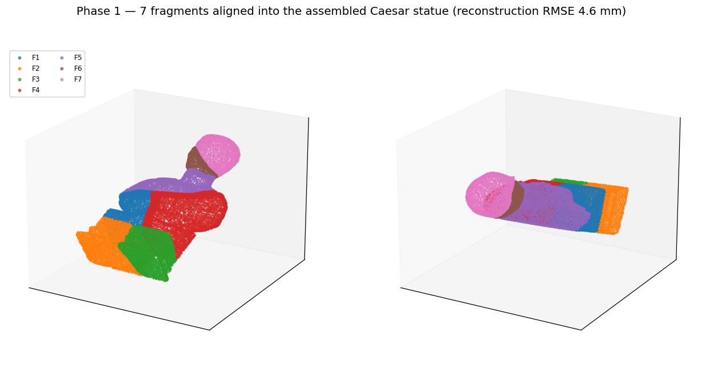
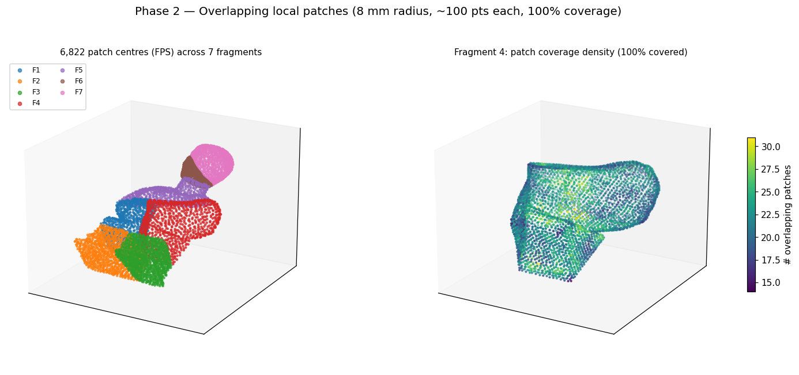
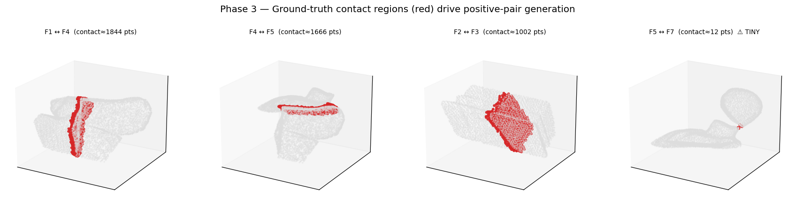
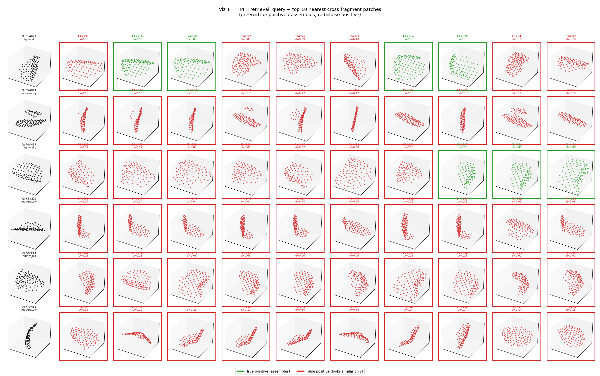
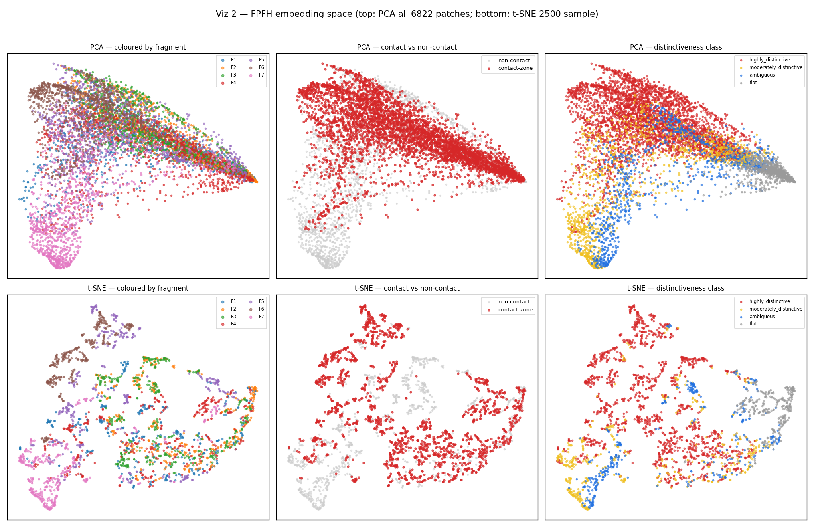
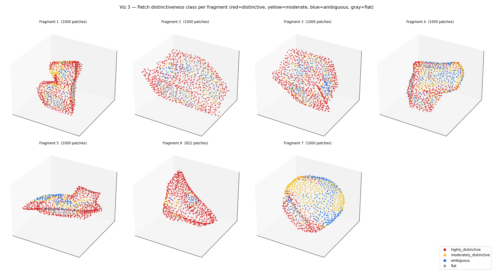
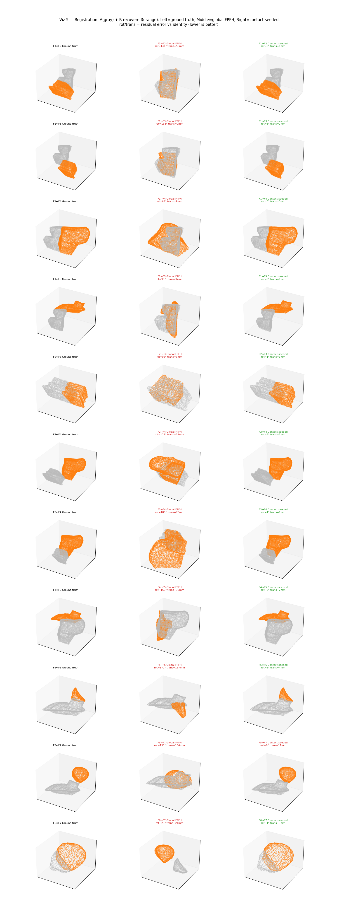
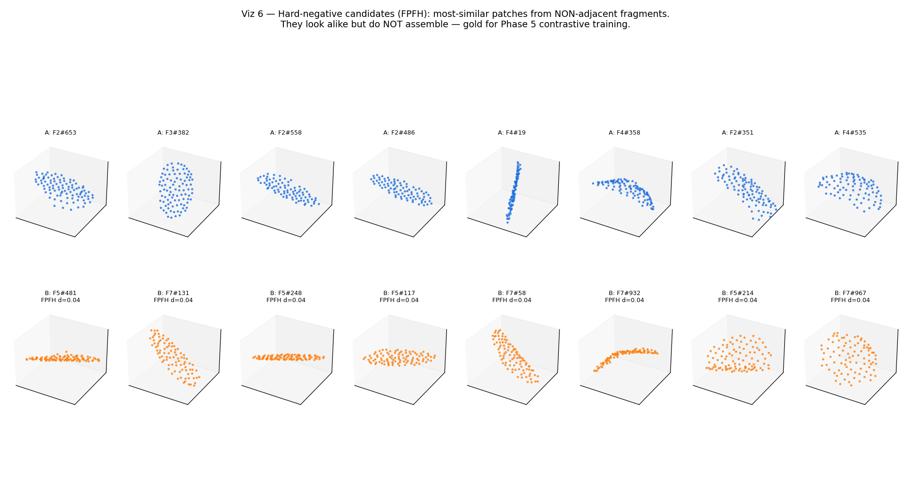
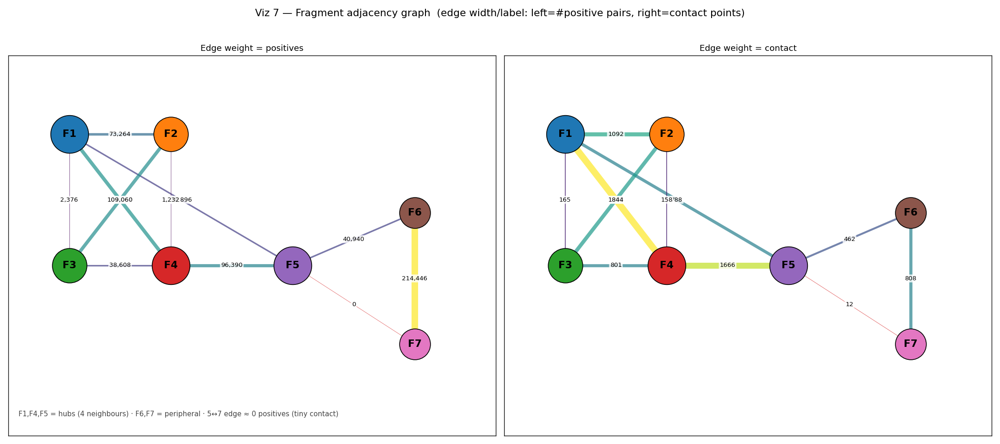
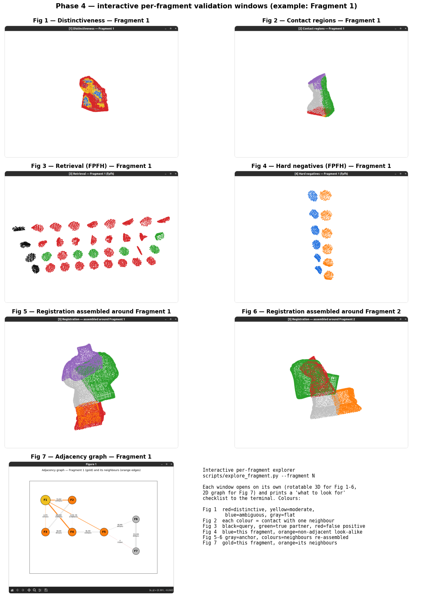

# Healing Stones — 3D Fragment Assembly for Fractured Cultural Heritage

A research-grade pipeline that reassembles a fractured 3D object from its
fragments alone — identifying which fragments are neighbours, where they match,
and how they fit together — **without access to the original object at inference
time**. The complete object is used only to generate training data and ground
truth. The running example is a fractured **Caesar statue** (7 real fragments).

<p align="center">
  
</p>

---

## Introduction

### Overview
Reassembling broken artifacts is a core task in archaeology and cultural
heritage conservation. This project builds that capability from the ground up as
a sequence of validated phases: clean data → local geometric patches → automatic
ground truth → non-learning baselines → (upcoming) learned descriptors →
retrieval → correspondence → registration → global assembly. Each phase has hard
deliverables and a validation gate before the next begins.

### Problem statement
Given only the fractured fragments of an object, the system must:
1. **Identify likely neighbouring fragments** (which pieces touch).
2. **Find matching geometric regions** (where they touch).
3. **Estimate fragment transformations** (how to place each piece).
4. **Reconstruct the original object** (global assembly).

The original object is available **only** for producing training data and ground
truth — never at inference.

### Research hypothesis
Most classical pipelines assume break surfaces can be reliably detected
(`fragment → break-surface detection → surface matching → registration`). On
real artifacts that assumption often fails: breaks can be smooth, weathered, or
indistinguishable from the original surface. This project deliberately avoids a
dedicated break-surface detector and instead asks a different question:

> **Which geometric regions provide useful evidence for assembly** — and can that
> evidence be learned directly, rather than hand-detected?

This forces a sharp conceptual distinction the system must respect:

| Concept | Meaning | Why it matters |
|--------|---------|----------------|
| **Similarity** | Two regions *look alike* | Necessary but **not** sufficient — many unrelated regions look alike |
| **Complementarity** | Two regions *fit into* each other (convex ↔ concave) | What assembly actually needs at a fracture |
| **Distinctiveness** | A region carries *unique* identifying geometry | Reduces false matches; flat/repeated regions are ambiguous |
| **Assembly usefulness** | A region contributes real evidence toward reconstruction | The quantity we ultimately want to learn |

A recurring theme (and an empirically confirmed one — see Phase 4) is that
**similarity ≠ assembly compatibility**.

---

## Repository structure

```
Healing_Stones/
├── data/                           # Source: caesar_full_model.ply + 7 fragment PLYs
├── config/                         # YAML configs, one per phase
│   ├── default.yaml                #   Phase 1
│   ├── patch_generation.yaml       #   Phase 2
│   ├── ground_truth.yaml           #   Phase 3
│   └── baseline_geometry.yaml      #   Phase 4
├── src/
│   ├── dataset_foundation/         # Phase 1 modules
│   ├── patch_generation/           # Phase 2 modules
│   ├── ground_truth_generation/    # Phase 3 modules
│   ├── baseline_geometry/          # Phase 4 modules (descriptors, retrieval, registration)
│   ├── phase5_diagnostics/         # Phase 5 diagnostic harness (FPFH baseline, LOFO, probes)
│   └── phase5_encoder/             # Phase 5 encoder (PointNet, PPF features, InfoNCE, mining)
├── scripts/                        # Pipelines, visualizers, interactive explorer, training
├── tests/                          # 186 tests (unit + Hypothesis property + integration)
├── dataset/                        # Phase 1 outputs (aligned/normalized clouds, transforms)
├── patches/                        # Phase 2 outputs (per-fragment patch archives)
├── pairs/ + phase3_final_review/   # Phase 3 outputs (labelled pairs, contact regions)
├── baseline_results/               # Phase 4 outputs (descriptors, metrics, visualizations)
├── phase5_diagnostics_results/     # Phase 5 diagnostic outputs (baseline JSON, probes)
├── phase5a_runs_6fold/             # Phase 5 LOFO training results (fold 2-4 eval JSONs)
├── phase5a_runs_jitter/            # Phase 5 Run 4 (working jitter, fold 1 eval JSON)
├── assets/                         # Figures used in this README
└── QUICKSTART.md · COMMANDS.md · PHASE{2,3,4,5}_COMPLETE.md · PHASE5_RESULTS_LOG.md
```

Documentation map:
- **QUICKSTART.md** — one-page command cheat sheet
- **COMMANDS.md** — complete, copy-pasteable command reference for every phase
- **PHASE{2,3,4}_COMPLETE.md** — detailed per-phase completion reports
- **PHASE5_RESULTS_LOG.md** — single source of truth for all Phase 5 measurements
- **PHASE5_PREREGISTRATION.md** — pass/fail thresholds fixed before any encoder was trained

---

## Getting started

### Requirements
Python 3.10, Open3D 0.19, NumPy (<2), SciPy, matplotlib, scikit-learn, PyYAML,
pytest, Hypothesis. (PyTorch is pinned for the upcoming learned phases but is not
required for Phases 1–4.)

```bash
git clone <your-repo-url> Healing_Stones
cd Healing_Stones
pip install -r requirements.txt
pip install matplotlib scikit-learn        # for the Phase 4 visualizations

# safety: cap memory on dense-cloud steps
ulimit -v 8000000
```

### Run the four completed phases end-to-end
```bash
# Phase 1 — Dataset Foundation
PYTHONPATH=src python3 -m dataset_foundation.pipeline --config config/default.yaml

# Phase 2 — Patch Generation
PYTHONPATH=src python3 -m patch_generation.pipeline --config config/patch_generation.yaml

# Phase 3 — Ground Truth Generation
PYTHONPATH=src python3 scripts/phase3_pipeline.py --config config/ground_truth.yaml

# Phase 4 — Baseline Geometry (descriptors + retrieval + registration)
PYTHONPATH=src python3 -m baseline_geometry.pipeline --config config/baseline_geometry.yaml

# Tests
python3 -m pytest tests/ -q
```

### Reproduce the figures in this README
```bash
PYTHONPATH=src python3 scripts/visualize_phase4.py --viz all      # Phase 4 diagnostics
PYTHONPATH=src python3 scripts/make_readme_figures.py             # Phase 1-3 figures + copies
```

### Explore results interactively (rotatable 3D windows, one fragment at a time)
```bash
PYTHONPATH=src python3 scripts/explore_fragment.py --fragment 5
```
Each window prints a "what to look for" checklist so results can be validated by eye.

---

## Commands reference

A complete copy-pasteable reference. All commands run from the repo root.

### Phase 1 — Dataset Foundation

**Run the pipeline** (loads fragments, imports transforms, estimates normals, normalizes, validates):
```bash
PYTHONPATH=src python3 -m dataset_foundation.pipeline --config config/default.yaml
```

**Visualize the aligned assembly** (interactive 3D window with labelled fragments):
```bash
PYTHONPATH=src python3 scripts/visualize.py --interactive
```

**Save an off-screen image** (no display required):
```bash
PYTHONPATH=src python3 scripts/visualize.py --save
```

**If alignment is wrong — re-align a fragment manually** (point-picking + ICP).
Opens two windows in sequence: click ≥ 3 matching points on the fragment, then the same points on the model.
```bash
# Re-align a single fragment by name substring
PYTHONPATH=src python3 scripts/manual_align.py --fragments caesar_fragment_2

# Re-align by part number (shorthand)
PYTHONPATH=src python3 scripts/manual_align.py --parts 2

# Re-align multiple fragments
PYTHONPATH=src python3 scripts/manual_align.py --parts 2,6,7

# Re-align all fragments
PYTHONPATH=src python3 scripts/manual_align.py
```
The tool writes the corrected transforms back into the config's `precomputed_transforms`; re-run the pipeline to regenerate outputs.

---

### Phase 2 — Patch Generation

**Run the pipeline** (FPS centres, radius neighbourhoods, coverage analysis):
```bash
PYTHONPATH=src python3 -m patch_generation.pipeline --config config/patch_generation.yaml
```

**Visualize patches — random sample from a fragment:**
```bash
PYTHONPATH=src python3 scripts/visualize_patches.py \
    --fragment fragment_caesar_fragment_1 --mode random --count 10
```

**Coverage heatmap** (how many patches cover each point):
```bash
PYTHONPATH=src python3 scripts/visualize_patches.py \
    --fragment fragment_caesar_fragment_1 --mode heatmap
```

**Inspect a single patch in detail:**
```bash
PYTHONPATH=src python3 scripts/visualize_patches.py \
    --fragment fragment_caesar_fragment_1 --mode single --patch-id 42
```

**Show all patch centres:**
```bash
PYTHONPATH=src python3 scripts/visualize_patches.py \
    --fragment fragment_caesar_fragment_1 --mode centers
```

**Patch size distribution:**
```bash
PYTHONPATH=src python3 scripts/visualize_patches.py \
    --fragment fragment_caesar_fragment_1 --mode sizes
```

---

### Phase 3 — Ground Truth Generation

**Run the pipeline** (adjacency detection, contact regions, positive/negative pair labelling):
```bash
PYTHONPATH=src python3 scripts/phase3_pipeline.py --config config/ground_truth.yaml
```

**Visualize contact regions:**
```bash
PYTHONPATH=src python3 scripts/visualize_phase3.py
```

---

### Phase 4 — Baseline Geometry

**Run the pipeline** (FPFH/SHOT descriptors, retrieval, registration):
```bash
PYTHONPATH=src python3 -m baseline_geometry.pipeline --config config/baseline_geometry.yaml
```

**Generate all Phase 4 diagnostic figures:**
```bash
PYTHONPATH=src python3 scripts/visualize_phase4.py --viz all
```

**Interactive per-fragment explorer** (rotatable 3D windows, one fragment at a time):
```bash
PYTHONPATH=src python3 scripts/explore_fragment.py --fragment 1   # 1..7
```

---

### Phase 5 — Patch Encoder

**Run the FPFH diagnostic baseline** (required before training):
```bash
PYTHONPATH=src python3 scripts/run_phase5_diagnostics.py
```

**Train the encoder — full 6-fold LOFO:**
```bash
export PYTORCH_CUDA_ALLOC_CONF=expandable_segments:True
PYTHONPATH=src python3 scripts/train_phase5a.py \
    --held-out fragment_caesar_fragment_1   # repeat for each fold 1..7
```

---

### Tests
```bash
python3 -m pytest tests/ -q          # all 186 tests
python3 -m pytest tests/ -q -x       # stop on first failure
```

---

## Phase 1 — Dataset Foundation ✅

**Goal.** Produce a clean dataset where every fragment is aligned to the complete
object, so the reassembled fragments reproduce the original.

**What it does.** Loads the full model and 7 fragments; imports/validates
alignment transforms (assisted manual alignment + ICP, because automatic global
alignment to a symmetric statue is unreliable); estimates normals; normalizes and
density-standardizes each cloud; and validates by reconstruction.

<p align="center">
  
</p>

**Results.**

| Metric | Value |
|--------|-------|
| Fragments aligned | 7 / 7 (visually confirmed) |
| Reconstruction RMSE | **4.60 mm** (< 5.0 threshold) ✅ |
| Coverage | 100% ✅ |
| Point spacing (mean) | 1.22 mm |

> **Lesson:** metrics are not correctness. Automatic FPFH+RANSAC alignment scored
> high fitness while snapping fragments to the *wrong* symmetric region — the
> visual check is the real gate. This lesson returns in Phase 4.

**Outputs:** `dataset/{fragments,transforms,normals,normalized,metadata}/`

---

## Phase 2 — Patch Generation ✅

**Goal.** Convert each fragment into overlapping local geometric patches — the
unit of everything downstream.

**What it does.** Farthest-Point-Sampling selects ~1000 centres per fragment;
each centre grows an 8 mm radius neighbourhood (capped at 128 points, ~100 on
average); overlap and coverage are analysed and validated.

<p align="center">
  
</p>

**Results.**

| Metric | Value |
|--------|-------|
| Total patches | **6,822** across 7 fragments |
| Coverage | 100% on every fragment ✅ |
| Mean overlap | ~27% |
| Mean patch size | ~100 points |

**Outputs:** `patches/<fragment>/patches.npz` (+ per-fragment and dataset metadata).

---

## Phase 3 — Ground Truth Generation ✅

**Goal.** Automatically generate the supervision signal — which patches are true
assembly partners (positives) and which are not (negatives).

**What it does.** Measures fragment-pair distances to find adjacencies
(data-driven 3.67 mm threshold = 3× point spacing); detects contact regions on
adjacent pairs; emits positive patch pairs from contacts and random negatives
from non-adjacent fragments.

<p align="center">
  
</p>

**Results.**

| Metric | Value |
|--------|-------|
| Adjacent fragment pairs | 11 of 21 |
| Positive pairs | 719,279 |
| Random-negative pairs | 719,270 |
| Total labelled pairs | **1,438,549** (50/50) |
| Compact table | `phase3_final_review/pairs.npz` (7.6 MB, 100× smaller than JSON) |

> **Known limitations (carried forward):** hard negatives = 0 (fragments are too
> patch-dense to find "far-but-similar" pairs spatially — Phase 4 solves this via
> descriptor similarity). Pair F5↔F7 has only ~7 contact points and yields no
> usable positives — a real, tiny adjacency.

**Outputs:** `pairs/` (positive/negative pairs, per-pair stats, contact regions)
and `phase3_final_review/pairs.npz`.

---

## Phase 4 — Baseline Geometry ✅

**Goal.** Establish *non-learning* baselines (FPFH + SHOT descriptors, retrieval,
and FPFH+RANSAC+ICP registration) and measure them against the Phase 3 ground
truth — **before** any deep learning. This is the bar later phases must beat, and
it quantifies the similarity-vs-complementarity gap.

**Validation gate: PASSED (4/4).** Descriptors for all 6,822 patches; both
descriptors beat chance; contact-mode registration cleanly separates from the
non-adjacent control.

### 4a. Retrieval — does similarity carry assembly signal?

For each query patch, rank all cross-fragment patches by descriptor distance;
green = a true assembly partner, red = a false positive.

<p align="center">
  
</p>

| Descriptor | Pair ROC-AUC | Ranking mAP | Precision@1 |
|-----------|:------------:|:-----------:|:-----------:|
| **FPFH** (33-D) | **0.708** | 0.109 | 0.13 |
| **SHOT** (352-D) | 0.536 | 0.086 | 0.11 |

FPFH beats chance but has **low absolute ranking power** — flat patches match
other flat patches, linear ridges match other ridges, and the true partner is
rarely nearest. This is *similarity*, not *compatibility*.

### 4b. Embedding space

<p align="center">
  
</p>

Contact-zone and non-contact patches are **intermixed** (FPFH cannot isolate
contacts); peripheral fragments (F6/F7) form their own islands (identity
leakage); but the distinctiveness gradient is clean — FPFH encodes shape
*complexity*, just not assembly relevance.

### 4c. Distinctiveness (potential patch weighting)

<p align="center">
  
</p>

Distinctive patches (red) ring edges and irregular features; flat/ambiguous
(gray/blue) fill smooth interiors — spatially coherent and useful for later
weighting.

### 4d. Registration — why global matching fails

Fragment B is perturbed by a **known** transform and recovered; error is measured
against ground truth (never fitness alone).

<p align="center">
  
</p>

| Mode | Adjacent success | Median rotation err | Median translation err |
|------|:----------------:|:-------------------:|:----------------------:|
| **Global** (FPFH+RANSAC+ICP, unaided) | **0 / 11** | 119° | 35 mm |
| **Contact-seeded** (GT interface + interface-only ICP) | **10 / 11** | **1.5°** | **1.6 mm** |

Global matching fails because fractured fragments **abut** (touch at a thin
interface) rather than **overlap**, so RANSAC maximises body overlap and snaps to
a wrong high-fitness pose. Seeding from the true interface — and crucially
refining ICP on the **contact interface only** — recovers 10/11 pairs. The lone
failure (F5↔F7, 7 contact points) is a genuine data limit, not an algorithm bug.

> **Takeaway:** the rigid-solver backend is sound; the hard problem is
> **localising the interface**, which is exactly what the learned phases (6–7)
> target.

### 4e. Hard negatives for Phase 5

<p align="center">
  
</p>

FPFH now supplies what Phase 3 couldn't: near-identical patches from
**non-adjacent** fragments (distance ≈ 0.04) that definitely don't assemble —
gold for contrastive training. Candidate list saved to
`baseline_results/visualizations/viz6_hard_negative_candidates_fpfh.json`.

### 4f. Fragment adjacency graph

<p align="center">
  
</p>

F1/F4/F5 are hubs (4 neighbours); F6/F7 are peripheral; the F5↔F7 edge is
effectively empty (tiny contact). Edge weight = #positive pairs / contact size.

### 4g. Interactive per-fragment validation

Beyond the summary figures above, an interactive explorer opens each diagnostic
in its own rotatable window, **one fragment at a time**, so results can be
validated by eye. Run it with:

```bash
PYTHONPATH=src python3 scripts/explore_fragment.py --fragment 1   # 1..7
```

Fig 1–7 below are the seven windows for **Fragment 1** (Fig 6 shows the same
registration view centred on Fragment 2 for comparison).

<p align="center">
  
</p>

- **Fig 1 — Distinctiveness.** The fragment's surface painted by patch class
  (red = distinctive, yellow = moderate, blue = ambiguous, gray = flat).
  *Validate:* red rings the edges and irregular features while gray/blue fills
  smooth interior areas — confirming the score tracks real geometric complexity.
- **Fig 2 — Contact regions.** Each colour marks where Fragment 1 touches a
  different neighbour (F2/F3/F4/F5). *Validate:* every coloured zone sits on a
  break/fracture face, not the outer sculpted surface.
- **Fig 3 — Retrieval (FPFH).** Each row: a black query patch from Fragment 1
  followed by its 8 nearest cross-fragment patches (green = true assembly
  partner, red = false positive). *Validate:* mostly red, with green rarely the
  closest — the visual meaning of *similarity ≠ compatibility*.
- **Fig 4 — Hard negatives (FPFH).** Blue patches on Fragment 1 beside their
  most-similar patches on a **non-adjacent** fragment (orange). *Validate:* the
  pairs look near-identical yet can never assemble — ideal Phase 5 hard
  negatives.
- **Fig 5 — Registration around Fragment 1.** Fragment 1 (gray, fixed) with its
  four neighbours perturbed by a known transform and recovered from the
  ground-truth interface. *Validate:* each coloured neighbour clicks back into
  its correct assembled pose, hugging the shared break.
- **Fig 6 — Registration around Fragment 2.** The same experiment centred on
  Fragment 2, showing the method generalises across anchors.
- **Fig 7 — Adjacency graph.** Fragment 1 (gold) and its neighbours (orange),
  edges labelled with #positive pairs and contact size. *Validate:* the orange
  neighbours match the contact zones seen in Fig 2.

> Each window also prints a "what to look for" checklist to the terminal, so the
> validation criteria above travel with the tool.

**Outputs:** `baseline_results/{descriptors,retrieval,registration,visualizations}/`
and `baseline_report.json`.

---

## Phase 5 — Patch Encoder (PointNet + Contrastive Learning) ✅

**Goal.** Train a learned patch encoder that beats FPFH on interface-association
retrieval and, more importantly, learns *complementarity* — so that break-surface
patches from adjacent fragments rank each other above geometrically similar but
non-adjacent patches.

**Pre-registration.** Pass/fail thresholds were fixed in `PHASE5_PREREGISTRATION.md`
*before* any encoder was trained — a six-condition Level-3 success definition
covering retrieval (mAP, P@1), the easy-vs-hard AUC gap (the complementarity
thesis), pose invariance, and fragment-identity leakage. See that file for exact
wording; no condition was weakened after the fact.

**What was built.**

- `src/phase5_diagnostics/` — diagnostic harness: FPFH baseline measurements,
  LOFO fold setup, shortcut battery (fragment-ID probe, boundary-openness,
  distinctiveness correlation), hard-negative stratification.
- `src/phase5_encoder/` — PointNet encoder with k-NN pairwise Point Pair
  Features (PPF, `k=16`, exactly rotation+translation invariant), InfoNCE
  contrastive loss, on-the-fly hard-negative mining, fragment-balanced LOFO
  sampler with capped inverse-frequency interface weighting, LayerNorm
  (not BatchNorm, to avoid distribution-shift confounds under LOFO).
- `scripts/train_phase5a.py` — full 6-fold LOFO training pipeline.
- `scripts/run_phase5_diagnostics.py` — FPFH baseline + diagnostic suite.
- **186 tests** (up from 150; new suites cover PPF rigid invariance, pose gate,
  sampler, mining cache correctness, and four regression tests for pre-training
  bugs found and fixed before any run).

**Architecture decisions (all measured, not assumed).**

| Decision | Why |
|----------|-----|
| k-NN PPF features (`N×k×4`) instead of PCA/SHOT frame | PCA canonicalization fails the pose gate by ~4500×; PPF passes exactly (`max_dev=0.0`). Removes the confound between "PointNet can't learn interfaces" and "unstable input frame". |
| LayerNorm over BatchNorm | BatchNorm eval-mode running stats fit only the 6 training fragments; a held-out fragment's distribution shift would be indistinguishable from a genuine retrieval failure. |
| Per-epoch on-the-fly mining, full non-adjacent pool | Targets the measured FPFH pathology directly (easy-vs-hard AUC gap = 0.614). Cached mining table (`_encode_training_table`) reduces mining from 18 s → 6 s/epoch (2.9× speedup). |
| Fragment-balanced sampler, capped inverse-frequency weighting | Raw interface pair counts span a 174× range; pure inverse-frequency overfits small interfaces. Cap at max_ratio=5 lifts the rarest interface to ~1.5× uniform draw rate without dominating. |

**Training runs (honest record — 4 runs, single variable changed each time).**

| Run | Change | Key finding |
|-----|--------|-------------|
| Run 1 | Baseline (50 epochs, steps_per_epoch=12) | val non-monotonic; mAP CI includes zero |
| Run 2 | Distance-capped positives (16 mm) | Fold-1 mAP CI excludes zero, but arbitrary checkpoint + unit bug = not durable |
| Run 3 | Unit fix: steps_per_epoch=12→7 (one anchor-pass), patience re-enabled | Patience fired ep10; val flat from ep2; working as intended |
| Run 4 | Jitter fix: per-(seed,epoch,frag,pid) noise instead of frozen constant seed | Patience fired ep20 (delayed vs ep10); best val improved 5.529→5.452; augmentation functioning |

**Defects found and fixed before/during training (documented, not hidden).**

Eight failure classes were identified and corrected across the project; the Phase 5
training loop contributed four new ones:

- `val_fraction` applied to pairs, not patches → 49,569 val pairs (9.8 GB) → capped to 499.
- Interface weighting inverted (measured: 55.4% draws to the rarest interface) → fixed, re-measured.
- `steps_per_epoch=12` — an "epoch" was 1.4% of pairs, so patience spanned noise → corrected to one full anchor-pass.
- Jitter augmentation used `seed=cfg.seed` (constant) → every patch saw identical noise every epoch → fixed to per-(seed,epoch,frag,pid) seeding.

**Results — 6-fold LOFO on well-supported folds {F1, F2, F3, F4}.**

| Fold | Enc mAP | FPFH mAP | Paired diff [95% CI] | Enc P@1 | FPFH P@1 |
|------|:-------:|:--------:|----------------------|:-------:|:--------:|
| F1 | 0.099 | 0.105 | −0.0067 [−0.010, −0.004] | 0.141 | 0.168 |
| F2 | 0.107 | 0.139 | −0.0322 [−0.036, −0.029] | 0.128 | 0.194 |
| F3 | 0.088 | 0.110 | −0.0220 [−0.024, −0.020] | 0.100 | 0.169 |
| F4 | 0.112 | 0.128 | −0.0166 [−0.020, −0.013] | 0.109 | 0.184 |

All four paired CIs exclude zero on the losing side. **Conditions 1–2 FAILED (0/4).**

Complementarity probe (encoder-mined easy-vs-hard AUC, valid self-adversarial test):

| Fold | Easy AUC | Hard AUC | Gap |
|------|:--------:|:--------:|:---:|
| F1 | 0.785 | 0.064 | 0.722 |
| F2 | 0.545 | 0.022 | 0.523 |
| F3 | 0.507 | 0.045 | 0.462 |
| F4 | 0.608 | 0.039 | 0.569 |

Hard-AUC is below chance on all four folds — the encoder ranks its own look-alikes
as *more* positive-like than true partners. **Condition 3 (thesis) NOT MET.**

Fragment-identity leakage (condition 6): encoder reduces FPFH's leakage by ~half
across all folds (e.g. F1: 0.519 vs FPFH 0.895, base rate 0.147). Improved,
but does not rescue conditions 1–3.

**Verdict: pre-registered NEGATIVE Level-3 result.**

> **What this means.** A PointNet encoder trained with symmetric co-membership
> labels on ~100-point / 8 mm patches from one 7-fragment artifact does not beat
> FPFH and does not learn complementarity. This is a clean, diagnosed result —
> not a failure of engineering. The root cause is the supervision signal: symmetric
> co-membership optimises for *similarity*, and a similarity metric cannot learn
> *complementarity* by construction. This directly motivates Phase 5B's asymmetric
> supervision (complementary-pair labels, not just co-membership) and validates
> the founding hypothesis that similarity ≠ assembly compatibility.

**Outputs:** `phase5_diagnostics_results/`, `phase5a_runs_6fold/`, `phase5a_runs_jitter/`,
`PHASE5_RESULTS_LOG.md`, `PHASE5_PREREGISTRATION.md`.

---

## Results at a glance

| Phase | Deliverable | Key result | Gate |
|:-----:|-------------|------------|:----:|
| 1 | Aligned dataset | Reconstruction RMSE 4.6 mm, 100% coverage | ✅ |
| 2 | Local patches | 6,822 patches, 100% coverage | ✅ |
| 3 | Ground-truth pairs | 1.44M labelled pairs, 11 adjacencies | ✅ |
| 4 | Non-learning baselines | FPFH AUC 0.708; contact registration 10/11 | ✅ |
| 5 | Patch encoder (PointNet + contrastive) | NEGATIVE Level-3 result — diagnosed root cause | ✅ |

**Tests:** 186 passing (unit + Hypothesis property + integration).

---

## Design philosophy

- **Understanding before implementation.** Every method is evaluated for what it
  learns, why it helps assembly, what ambiguities remain, and how it fails —
  before it is built.
- **Baselines before deep learning.** Simpler, interpretable methods are the
  reference; a neural model must earn its complexity against them.
- **Explicit failure analysis.** Each phase documents how it can fail on real and
  synthetic fractures, and how that failure would surface downstream.
